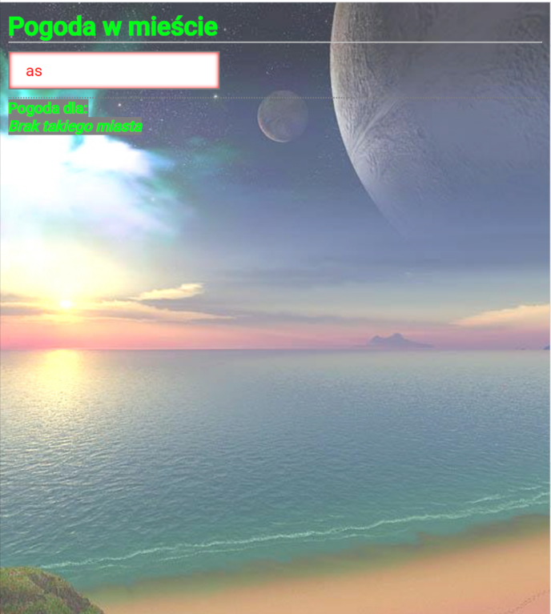
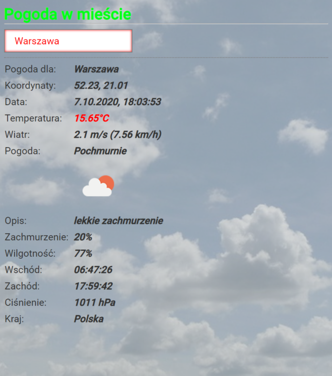

## Weather forecast for city in JavaScript XMLHttpRequest

design features

* mede in JavaScript
* asynchronous requests taking JSON data
* REST API used by fetch
* dynamic data after typing into input
* current weather data for the city you type
* lots of useful weather information for the city of your choice
* useful functionality - the background of the page changes and depends on the weather in the city you enter in the input field

#### Before using
* before using it, you need to enter API key in the file - script1.js, info in README
* key download page - https://openweathermap.org/api
* replace code from script1.js to script.js - app is ready to use

#### image from the page

